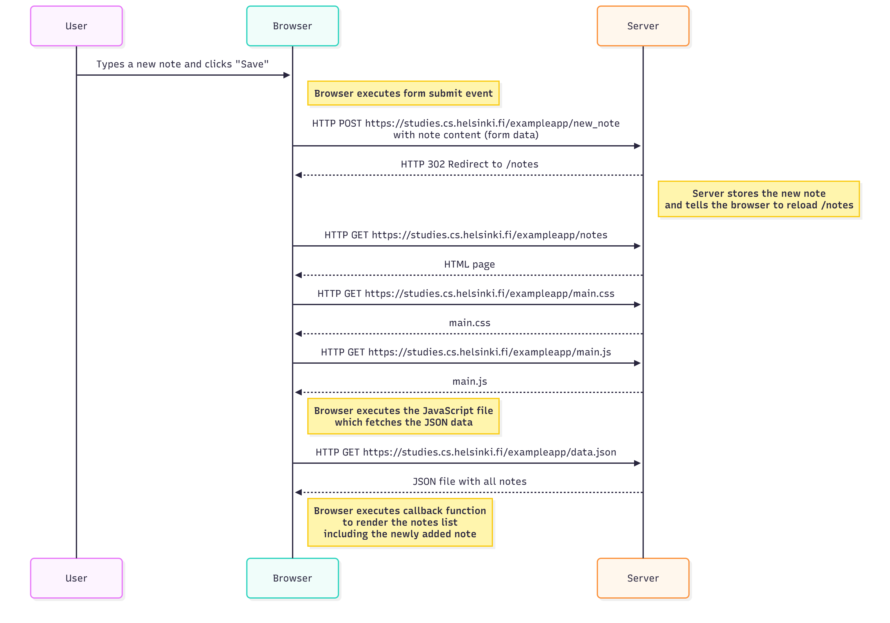
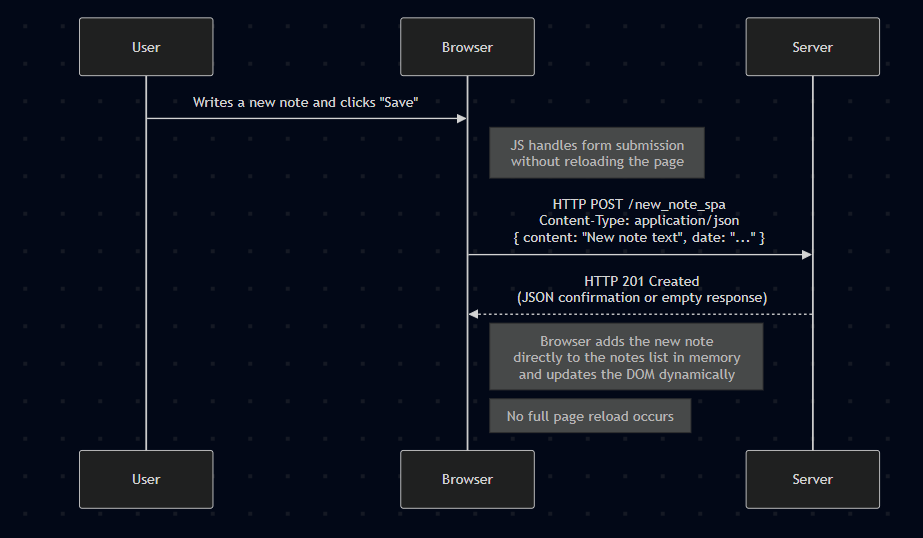
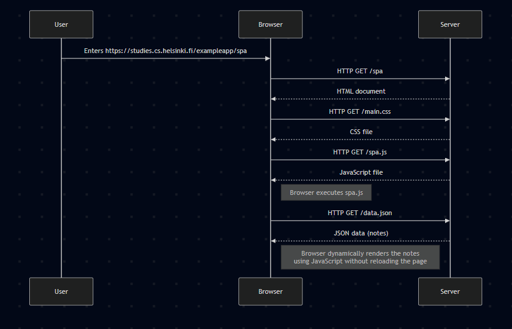

# Part 0 – Exercises

## 0.4: New Note Diagram
Diagram showing how the browser executes the JavaScript loaded from the server.

_Explanation_:  
When the user opens the page, the browser requests HTML, then JS and CSS.  
The JS is executed in the browser, which makes a request to the server for the data.

---

## 0.5: Single Page App Diagram
Diagram showing how JavaScript and APIs work together in a SPA.

_Explanation_:  
In a single page app, the browser loads the initial HTML + JS bundle once.  
Then JavaScript dynamically updates the DOM without full page reloads.

---

## 0.6: New Note in SPA Diagram
Diagram showing what happens when a user adds a new note in the SPA.

_Explanation_:  
The JS in the browser sends the new note to the backend using an HTTP POST request.  
The backend saves it and responds with updated data, which JS uses to update the UI.
